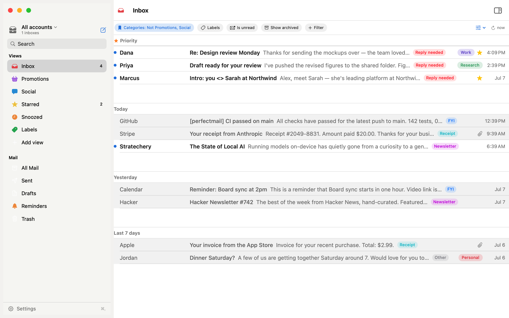
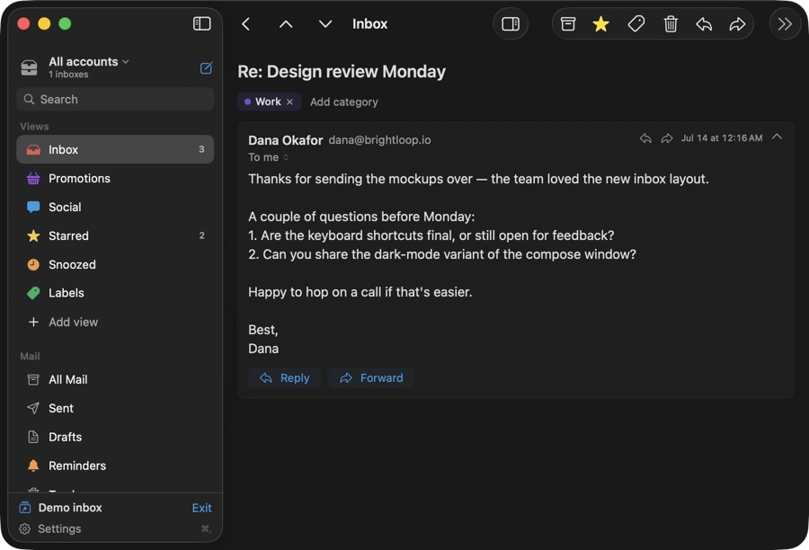
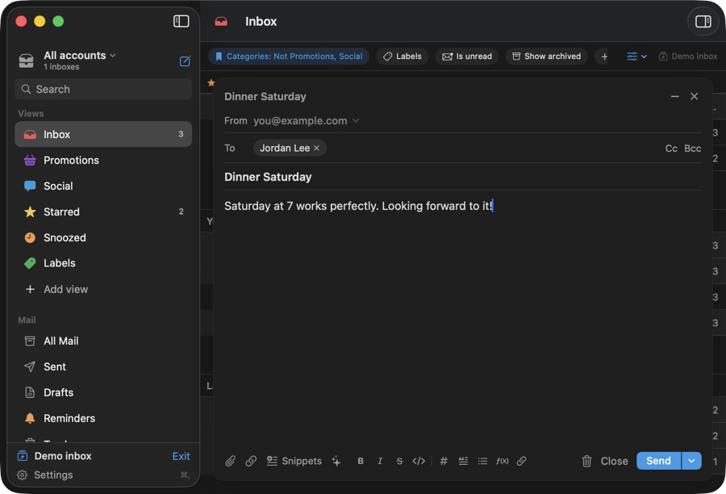

# MishMail

A native, local-first Gmail client for macOS. SwiftUI, Gmail REST API, SQLite.
No server, no telemetry — nothing leaves your Mac except calls to Google's own
API (and, optionally, a local Ollama model that also never leaves the machine).

> **Status:** early but usable (v0.x). Built for people who want a fast,
> keyboard-driven, Notion-Mail-style inbox that runs entirely on their own
> hardware. Contributions welcome — see [CONTRIBUTING.md](CONTRIBUTING.md).



| Read a conversation | Compose without leaving your inbox |
|---|---|
|  |  |

## Try MishMail

- **Build from source (recommended):** clone the repository, install
  `xcodegen`, then run `make run`. The Debug app opens an isolated demo inbox.
- **Download the current development build:** use
  [GitHub Releases](https://github.com/ronboger/mishmail/releases/latest).
  It is development-signed but not notarized yet, so macOS may require you to
  right-click the app and choose **Open** on first launch.
- **Explore safely:** on first launch, choose **Try demo inbox** to browse
  fictional mail before connecting Google. Demo mode never syncs or sends.
Connecting a real inbox requires your own free Google Desktop OAuth client;
the guided setup is below. You can evaluate the entire interface first.

## Features

- **Unified multi-account inbox** — connect several Google accounts; view them
  together or scoped to one, with per-account nicknames and send-as names.
- **Saved views & live filters** — build a filtered inbox from ~18 dimensions
  (label, category, from/to/cc/bcc, subject, date, calendar-invite, read
  state…) and save it as a reusable view.
- **Keyboard-first** — archive, trash, star, snooze, reply, navigate, and a
  `Cmd-K` command palette without touching the mouse.
- **Local-first sync** — mail is cached in an encrypted SQLite database with
  FTS5 full-text search; the app is fast and works offline for cached mail.
- **Compose that gets out of the way** — recipient chips with autocomplete from
  mined contacts, Cc/Bcc, quote-on-reply, reply-all dedup, attachments, drafts
  that round-trip to Gmail, and markdown in the body (bold/italic/headings/
  lists/code/math) with shortcuts and an HTML alternative on send.
- **Scheduled send, undo send, snooze, follow-up reminders, snippets.**
  Snippets trigger with `/name` in the body (Notion Mail-style), fill
  variables like `{first_name}` and `{my_first_name}`, and can move an
  introducer to Bcc for you.
- **Optional on-device AI** — draft and summarize with a local
  [Ollama](https://ollama.com) model. Nothing is uploaded; it works in airplane
  mode. Off unless you turn it on.
- **Private by construction** — see [Security](#security).

## Requirements

- **macOS 14.0+**
- **Xcode 15.3+** (Swift 5.10) to build
- **[xcodegen](https://github.com/yonaskolb/XcodeGen)** — `brew install xcodegen`
- A **free Google account** and a personal OAuth client (see below)
- *(optional)* **Ollama** for on-device AI drafting/summaries

## One-time Google setup (~5 minutes)

The app uses **your own** free Google OAuth client, so no third party ever sees
your mail. (See [Why bring your own client?](#why-bring-your-own-oauth-client)
for the reasoning.)

1. Go to https://console.cloud.google.com/ and create a project (e.g. "MishMail").
2. **APIs & Services → Library** → search "Gmail API" → **Enable**.
3. **APIs & Services → OAuth consent screen**:
   - User type: **External**, fill in app name + your email, save.
   - Under **Audience / Test users**, add every Google account you want to
     connect. (Testing mode allows up to **100** test users — plenty for
     personal use.)
   - Leave it in **Testing** mode (no Google verification needed; refresh tokens
     for desktop clients don't expire in testing for Gmail scopes — if one ever
     does, just re-sign-in).
4. **APIs & Services → Credentials → Create Credentials → OAuth client ID**:
   - Application type: **Desktop app**.
   - Copy the **Client ID** and **Client Secret** (or download the
     `client_secret_*.json`).
5. Launch MishMail → **Settings (Cmd-,) → Google API** → paste both.
   (Debug and Release are separate apps with separate Keychains — paste into
   whichever build you're using. Never commit client secrets; each person brings
   their own free Desktop client.)
6. Sidebar → **Add Google Account…** → your browser opens → sign in → the
   browser redirects to `http://127.0.0.1:<port>/oauth2/callback` → you should
   see **“Signed in.”** → return to MishMail; the account appears. Repeat for
   each account.

> During sign-in Google shows a **"Google hasn't verified this app"** screen
> because it's your own unverified test client. That's expected — click
> **Advanced → Continue**. The requested scope is `gmail.modify` plus your basic
> profile (email/name); MishMail never sees a password.

### Why bring your own OAuth client?

Shipping a shared client ID would make MishMail a data broker for every
user's mailbox and would drag the project through Google's restricted-scope
verification (a CASA security assessment for `gmail.modify`). Bring-your-own
client keeps your mail flowing only between your Mac and Google — nobody else,
including the author, is ever in the loop. It costs you five minutes once.

## Build & run

```sh
brew install xcodegen        # once
xcodegen generate
xcodebuild -project MishMail.xcodeproj -scheme MishMail -configuration Release build
```

Or, with the included Makefile:

```sh
make run      # build + open an isolated fictional inbox
make build    # generate + build without launching
make test     # run the hostless unit tests
make ui-test  # run the demo-inbox UI smoke test
make hooks    # install a pre-commit hook that runs unit tests
```

Or open `MishMail.xcodeproj` in Xcode and hit Run.

### Signing

By default the app is **ad-hoc signed** ("Sign to Run Locally"), so it builds
and runs on any Mac with no Apple Developer account. Signing settings live in
[`Config/Signing.xcconfig`](Config/Signing.xcconfig).

Ad-hoc signatures do not establish publisher identity. For that reason, an
ad-hoc/source installation will only accept in-app executable updates that are
Developer ID signed and notarized; otherwise it opens the GitHub release page.

To sign with your own Apple Developer team — required for **notarization**, and
handy for a stable identity that stops the Keychain re-prompting on every
rebuild — create `Config/Local.xcconfig` (git-ignored):

```
CODE_SIGN_STYLE = Automatic
DEVELOPMENT_TEAM = XXXXXXXXXX
CODE_SIGN_IDENTITY = Apple Development
```

### Releases & updates

MishMail publishes binaries to GitHub Releases (`ronboger/mishmail`). The
app checks once a day; when a newer version exists, an **Update app** button
appears at the bottom of the sidebar and in **Settings → Updates** — clicking it
downloads the release zip, then drag the new MishMail into Applications to
replace the old copy.

To cut a release: bump `MARKETING_VERSION` in `project.yml`, then

```sh
make release    # runs tests, builds Release, zips, gh release create v<version>
```

See [docs/RELEASING.md](docs/RELEASING.md) for the full step-by-step checklist,
tag/version rules, Developer ID signing + notarization, and troubleshooting.

For a distributable binary, sign with a Developer ID, keep
`ENABLE_HARDENED_RUNTIME` on (it already is), and notarize with `notarytool`.
Each user still needs their own Google OAuth client (see above), so building
from source stays a first-class path.


### Screenshots

The images in this README come straight from the real app (`make run` or
`make install`). Before capturing, pick or set up an inbox you're comfortable
publishing — redact/crop anything sensitive (real names, subjects, addresses)
before saving. Capture with **⌘⇧4 then Space** to grab the window, and save
into [`docs/screenshots/`](docs/screenshots/) using the filenames referenced
above.


## Keyboard shortcuts

Press **`?`** anywhere to see the full cheat sheet, reflecting any custom
bindings. The single-key commands below are **customizable** in **Settings →
Keyboard shortcuts** — click a key, press the new one (conflicts are refused).
The defaults are Gmail's:

| Key | Action | | Key | Action |
|---|---|---|---|---|
| j / k | Next / previous thread | | r | Reply |
| e | Archive | | a | Reply all |
| # | Trash | | f | Forward newest message (new conversation; use thread ⋮ → Forward all for the whole thread) |
| s | Star / unstar | | l | Label… |
| u | Toggle read / unread | | c | Compose |
| b or h | Snooze… (picker) | | z | Undo last action |

Fixed shortcuts (not customizable):

| Key | Action |
|---|---|
| g then i / s / t / d / a / p | Go to Inbox / Starred / Sent / Drafts / All mail / Promotions |
| ↑ / ↓ | Browse threads (without opening the reading pane) |
| Return | Open selected thread · Esc closes the reading pane |
| ? | Show the keyboard-shortcut cheat sheet |
| Cmd-K | Command palette · in compose body: insert/edit link |
| Ctrl-F | Filter menu |
| Cmd-N | Compose · Cmd-Enter send |
| / (in compose body) | Snippet picker — type `/name` to filter, Return inserts |
| Cmd-/ (in compose) | Toggle the snippets panel |
| ⌘B / ⌘I / ⌘⇧X / ⌘E | Bold / italic / strikethrough / code (compose body) |
| ⌘⇧M / ⌘⌥1–3 / ⌘⇧. / ⌘⇧8 | Math / H1–H3 / quote / bullet (compose body) |
| Cmd-Shift-R | Sync all |
| Cmd-+ / Cmd-− / Cmd-0 | Text size |
| Cmd-, | Settings |

## On-device AI (optional)

Install [Ollama](https://ollama.com) and pull a small model:

```sh
ollama pull llama3.2
```

Then in **Settings → AI** point MishMail at your local Ollama (default
`http://127.0.0.1:11434`). You get "Draft with AI" in compose and thread
summaries — all computed locally. MishMail refuses cleartext non-loopback
endpoints, and requires an explicit “Allow remote Ollama” toggle before any
mail content is sent to a remote HTTPS host.

## Where things live

- Mail cache (SQLCipher-encrypted): `~/Library/Containers/dev.ronboger.MishMail/Data/Library/Application Support/MishMail/mail.sqlite`
- OAuth refresh tokens, client secret, and the DB key: macOS Keychain (`dev.ronboger.MishMail`)

## Security

- **OAuth 2.0 Authorization Code + PKCE**, loopback redirect bound to
  `127.0.0.1` only (RFC 8252), fixed callback path, 5-minute listener timeout,
  and state-checked responses so a local probe can't abort or hijack sign-in.
  Tokens go straight to the Keychain (device-bound, not synced to iCloud,
  excluded from backups).
- **Encrypted at rest** — the local mail cache is SQLCipher-encrypted with a
  256-bit key held only in the Keychain.
- **HTML email is sandboxed** — rendered with JavaScript disabled, a strict CSP
  (`default-src 'none'`, `base-uri 'none'`, no forms/frames/objects), remote
  images blocked until you opt in (per message, per conversation, or via the
  Settings image policy: Ask / VIP senders / Always; HTTPS only — no cleartext
  tracking pixels), an ephemeral web data store, and a default-deny navigation
  policy so crafted mail can't redirect, auto-submit forms, or reach the
  network. Links open in your default browser.
- **Attachments** written to disk are tagged with the quarantine attribute, so
  Gatekeeper's first-open checks still apply; opening app/script/installer-like
  filenames asks for confirmation first.
- **Updates are verified** — "Update App" downloads the release zip, checks the
  published **SHA-256**, the embedded app's code signature, **Team ID** continuity
  with the running build, and **notarization** for Developer ID releases, then
  reveals the app in Finder. A failed check opens the GitHub release page
  instead of handing you an unverified binary.
- **App Sandbox** enabled with a minimal entitlement set (network client, the
  transient loopback listener for sign-in, and user-selected file access).
  `make release` uses `MishMail.Distribution.entitlements` (library validation
  on) whenever `Config/Local.xcconfig` sets a `DEVELOPMENT_TEAM` — see
  [docs/RELEASING.md](docs/RELEASING.md).
- **No secret logging**, parameterized SQL throughout, CRLF-folded MIME headers,
  and path-traversal-safe attachment filenames.
- **No bundled Google secrets** — every user (and every Debug vs Release copy)
  pastes their own OAuth client in Settings; nothing leaves the machine except
  calls to Google.
- Snooze and reminders are local-only (Gmail's API has no snooze); everything
  else — archive, trash, star, read state, send/reply — syncs to Gmail
  immediately.

See [SECURITY.md](SECURITY.md) for how to report a vulnerability.

## Support

MishMail is free and always will be — no accounts, no upsells, no telemetry. If
it's earned a place in your day and you'd like to help keep it maintained, a tip
is genuinely appreciated (but never expected):

- **[GitHub Sponsors](https://github.com/sponsors/ronboger)** — one-time or
  monthly, 0% platform fee.
- **Ethereum** — `0x34fC989CF3eF410F7fa1D3B236DA42d88005e99B`

Prefer to contribute code or a bug report instead? That's worth more than money —
see [CONTRIBUTING.md](CONTRIBUTING.md).

## License

[MIT](LICENSE) © 2026 Ron Boger. Depends on
[GRDB.swift](https://github.com/duckduckgo/GRDB.swift) (SQLCipher build, MIT).
